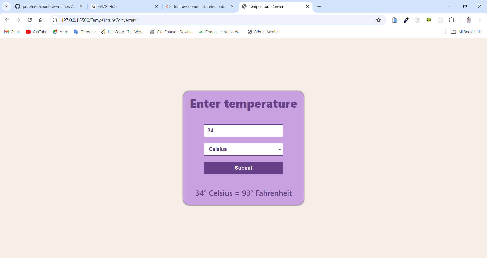

# Temperature Converter 

## Project Overview
The **Temperature Converter** is a web-based application designed to convert temperatures between Celsius and Fahrenheit. The user inputs a temperature value and selects either Celsius or Fahrenheit as the input scale, and the app will convert the input to the corresponding temperature in the other scale.

## GitHub Pages Deployed Link
[Visit Live Project 🔗](https://probhask.github.io/temperature-converter/)
```bash
https://probhask.github.io/temperature-converter
/
```



## Technologies Used
- **HTML5**: For the structure of the web page.
- **CSS3**: For styling and responsive design.
- **JavaScript (ES6)**: For the temperature conversion logic.

## File Structure
```
temperature-converter/
├── index.html # Main HTML file for the application 
├── style.css # Stylesheet for the application 
└── script.js # JavaScript file containing the logic for temperature
```

## How to Run the Project

1. Clone the repository:
   ```bash
   git clone https://probhask.github.io/temperature-converter.git
   ```
2. Navigate to the project folder:
   ```bash
   cd temperature-converter
   ```
4. Open index.html in any web browser to view the application.


## Conclusion

This project demonstrates how simple web applications can be built using fundamental web technologies: HTML, CSS, and JavaScript. The app serves as a functional temperature converter with a user-friendly interface and responsive design.
---